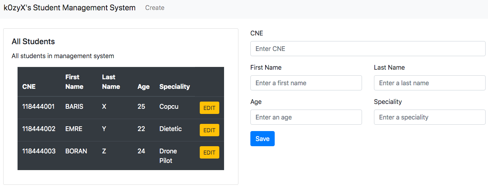

# Student-Management-System
Student Management System with Laravel and Bootstrap
It is my first PHP project with Laravel 7

# How can you run it
First of all you must set your database configuration on `Student-Management-System/.env` file. 

After that you must run `php artisan migrate` command. This command will create your databases.

And finally you will run the `php artisan serve` command. You can see this website on your browser in `http://127.0.0.1:8000/` address.

# Screens
